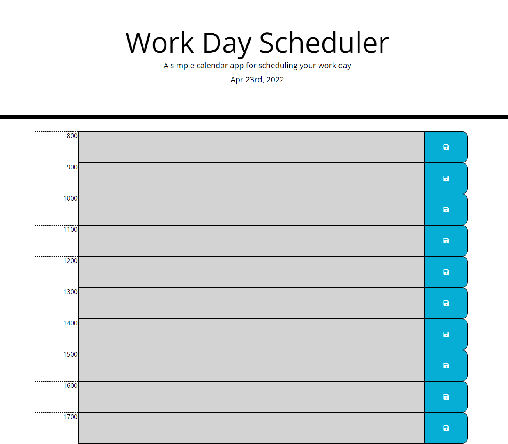

Greetings!

Thank you for checking out my Daily Planner App!

I apologize that it is not complete as I was(still am) sick the whole week, but I present to you with that I do have and I hope you like it!

This planner can be utilized to help you successfully allocate the hours of your work day from 8am to 5pm when you (hopefully) clock out from work.
The current hour is indicated by a red bar, with past hour slots indicated by gray and future hour slots indicated by green. You can click on each
hour slot to add in any activities you hope to complete in that time frame and click on the save icon on the right to lock it in. Once the day
finishes, all this info will be reset and you can use it again the following day.

This project utilizes moment.js to keep track of time and dictate what color each time slot is. It also employs alot of jquery to select for elements
and dynamically create new elements and add appropriate classes to it.

I hope you enjoy, thank you!

You can find this project at

https://yippeejimmee.github.io/DailyPlanner/

